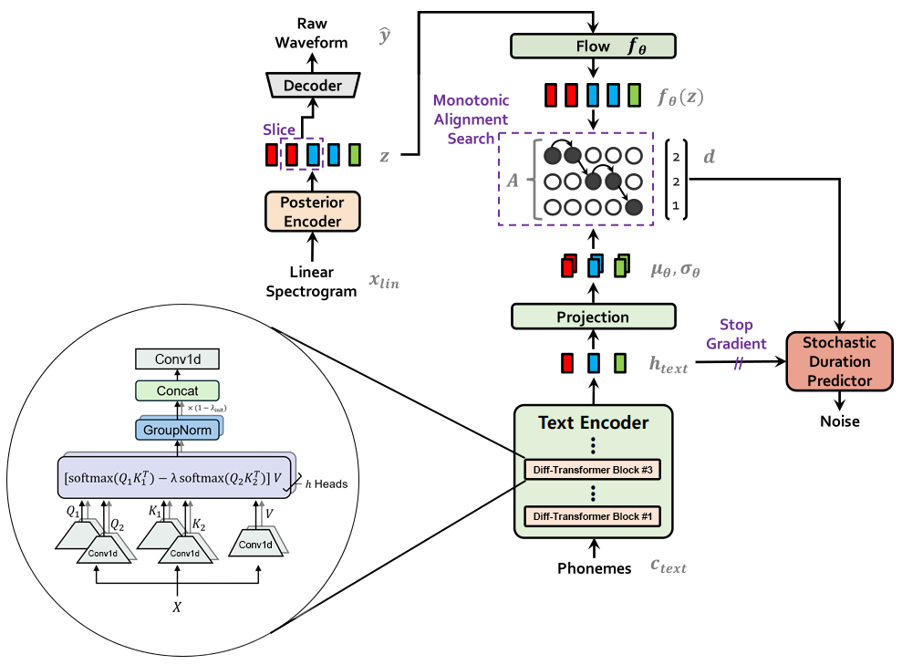

# DTF-VITS

An experimental variation of VITS with Microsoft's [Differential Transformer](https://arxiv.org/pdf/2410.05258) method applied on its text encoder.

## Models
`normal` is the original VITS model with its default setting of 2 transformer heads for comparison. [#](https://huggingface.co/FENRlR/DTF-VITS/tree/main/normal)

`dtf` is a modified VITS model with 1 differential transformer head. [#](https://huggingface.co/FENRlR/DTF-VITS/tree/main/dtf)

`dtf_v2` is a modified VITS model with 2 differential transformer heads. [#](https://huggingface.co/FENRlR/DTF-VITS/tree/main/dtf_v2)

Each model was trained with LJ Speech dataset for 20000 steps.

https://github.com/user-attachments/assets/2b95f269-9f11-4e52-b6ae-a199d9e368ae

Demonstration of all 50 test samples by each model.

https://github.com/user-attachments/assets/11b9490d-81d4-4531-becf-dcc1992a5ff0

Comparison of `normal` and `dtf`.

## Test results using [NISQA](https://github.com/gabrielmittag/NISQA)
For each sentence in [test script](./testscript.txt), 10 wav files were generated and tested through NISQA(v2.0) model. 
| Model |	MOS | Noisiness | Discontinuity | Coloration | Loudness |
| :---: | :---: | :---: | :---: | :---: | :---: |
| normal |	4.32 ± 0.37 |	3.87 ± 0.41 |	4.53 ± 0.28 |	4.31 ± 0.22 |	4.51 ± 0.18 |
| dtf |	4.24 ± 0.37 |	3.79 ± 0.42 |	4.51 ± 0.30 |	4.28 ± 0.24 |	4.49 ± 0.20 |
| dtf_v2 |	4.24 ± 0.37 |	3.86 ± 0.44 |	4.53 ± 0.27 |	4.26 ± 0.23 |	4.47 ± 0.20 |
